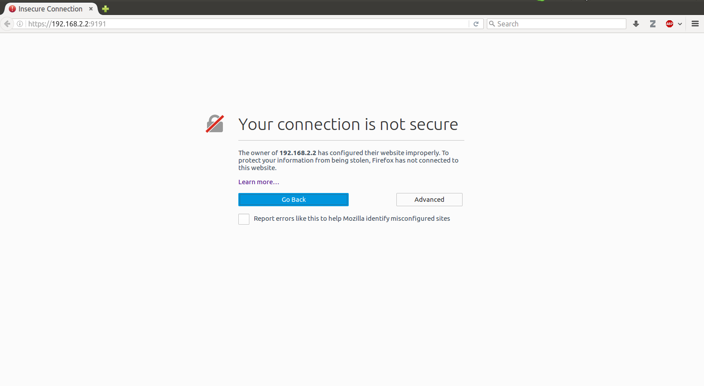

# Hands on With Heritrix

The reality of any hands-on workshop is that things will break. We've tried our best to provide a robust VM that can let you walk through the basics of Heritrix.

If you have any questions, let me know!

- [Nick Ruest](https://github.com/ruebot)

## Table of Contents

* 1. [Installation](https://github.com/web-archive-group/heritrix-walkthrough/blob/master/walkthrough/lessonplan.md#installation)
* 2. [Launching Heritrix](https://github.com/web-archive-group/heritrix-walkthrough/blob/master/walkthrough/lessonplan.md#testing)

## Installation

Download and install each of the following dependencies.

1. [VirtualBox](https://www.virtualbox.org/)
2. [Vagrant](http://www.vagrantup.com/)
3. [Git](https://git-scm.com/)

To build the machine using vagrant, you need to get your virtual machine running on the command line. For a basic walkthrough of how to use the command line, please consult [this lesson at the Programming Historian](http://programminghistorian.org/lessons/intro-to-bash).

From a working directory, please run the following commands.

1. `git clone https://github.com/web-archive-group/heritrix-walkthrough.git` (this clones this repository)
2. `cd heritrix-walkhrough` (this changes into the repository directory)
3. `vagrant up` (this builds the virtual machine - it will take a while and download a lot of data)

Once you run these three commands, you will have a running virtual machine with Heritrix installed.

You'll now need to connect to the machine. Now you need to connect to the machine. This will be done through your command line, but also through your browser through the Heritrix web interface.

You can connect to the machine's shell via ssh:

`vagrant ssh`

## Launching Heritrix

We'll be working from the [Heritrix 3 User Guide](https://webarchive.jira.com/wiki/display/Heritrix/Heritrix+3.0+and+3.1+User+Guide). Our Vagrant machine only prepares us with a base environment -- installing Java -- and downloading Heritrix for us. With that, the first thing we'll need to do is get Heritrix up and running, and based on the [guide](https://webarchive.jira.com/wiki/display/Heritrix/Running+Heritrix+3.0+and+3.1), we'll run the following command:

`/home/vagrant/project/heritrix-3.2.0/bin/heritrix -a vagrant:password -p 9191 -b 192.168.2.2`

If it runs successfully, you should see something like this:

```
Wed Jun  1 21:55:46 UTC 2016 Heritrix starting (pid 11450).
Using ad-hoc HTTPS certificate with fingerprint...
SHA1:31:4B:C6:94:3E:49:17:12:98:A8:3D:F4:BF:C8:44:6A:2F:FC:0E:2A
Verify in browser before accepting exception.
engine listening at port 9191
operator login set per command-line
NOTE: We recommend a longer, stronger password, especially if your web
interface will be internet-accessible.
```

What does that command actually do?

* `/home/vagrant/project/heritrix-3.2.0/bin/heritrix` is the path to the Heritrix executable;
* `-a vagrant:password` is our credentials we will use to access the web interface of Heritrix;
* `-p 9191` is the port we bind Heritrix to;
* `-b 192.168.2.2` is the ip address we bind Heritrix to.

How do we access the Heritrix web interface? Just direct your browser to [https://192.168.2.2:9191](https://192.168.2.2:9191), or just click on that link. :smile:

If you are accessing this url for the first time, you'll get a notification from your browser because we are accessing it over https, and the certificate is unknown. You'll see something like this:

**Firefox**



**Chrome**


You'll be prompted to confirm the certificate, and then you should be prompted for a username and password (vagrant, password). If everything goes correctly, you should see something like this:


## Tour of the Heritrix Web Interface

## Running a simple first job

## Tour of the project directory

## Running a job from a seed list

For this job, we'll take a look at the example of the #elxn42 crawl. The use case here is that we have a list of unique URLs taken from collecting the #exln42 hashtag. Our [seed list](../files/elxn42-tweet-urls.txt) is a line-oriented text file with a URL per line.

How do we setup our `crawler-beans.cxml` to use this seed list? Let's look at lines 86-94:

```xml
<bean id="seeds" class="org.archive.modules.seeds.TextSeedModule">
 <property name="textSource">
  <bean class="org.archive.spring.ConfigFile">
    <property name="path" value="/home/vagrant/elxn42-tweets-urls.txt" />
  </bean>
 </property>
 <property name='sourceTagSeeds' value='false'/>
 <property name='blockAwaitingSeedLines' value='-1'/>
</bean>
```

Our key is: `<property name="path" value="/home/vagrant/elxn42-tweet-urls.txt" />`. We need only give it the path to the seed list file.

But, what if we only want to capture just the URLs in the seed list, not hop out and crawl from there? Let's jump down to lines 124-132:

```xml
<!-- ...but REJECT those more than a configured link-hop-count from start... -->
<bean class="org.archive.modules.deciderules.TooManyHopsDecideRule">
  <property name="maxHops" value="0" />
</bean>
<!-- ...but ACCEPT those more than a configured link-hop-count from start... -->
<bean class="org.archive.modules.deciderules.TransclusionDecideRule">
 <property name="maxTransHops" value="0" />
 <property name="maxSpeculativeHops" value="0" />
</bean>
```

We'll need to set our hops to `0`. Otherwise, we might end up crawling most of the internet. :-)

## Running a job with regex
